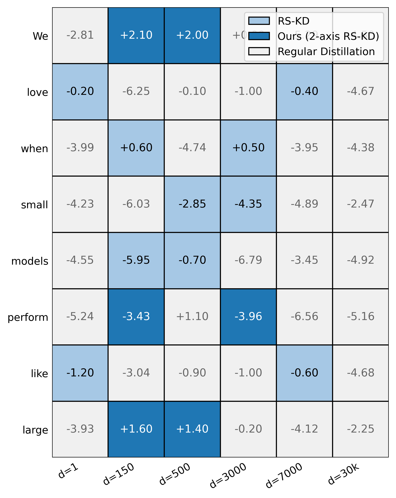
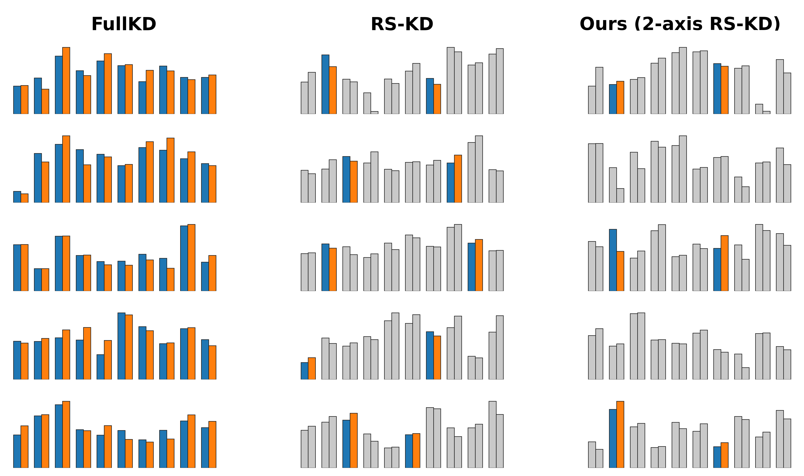

# SampledKD

A two-axis, token-efficient method for  efficient knowledge distillation for LLMs:

- **Tokens-selective KD (TSKD)**: instead of distilling every token, **enirely skip** the non informative ones and distill only a small set of "fork" high-entropy tokens per sequence. **Save compute on the Y axis**.
- **SampledKD**: Same as TSKD, but combined with randomly sampled KD (RS-KD) over classes (logits): at selected positions, distill over a tiny cached subset of teacher logits, and importance weighting,the sampling match full-KD gradients in expectation. We now **save compute also on the X axis**.

We create an offline cache, to get acheive "teacher not in the loop" distillation, only with saving $U=12$ sampled classes (a +1-byte from RS-KD, for entropy) per position; online we sample K positions and compute KD only over those cached classes.

Assuming the Y axis is positions (the text's tokens), our KL divergence looks like:

## Highlights

- SampledKD comes with lots of modes: Token selection by teacher entropy, by a score that combines CE & KL, with global FIFO (GLS) thresholding, with RS-KD like tokens selection and with a tiny dedicated model for selection trains from the loss.
- Unbiased class sampling via RS-KD; compact cache: $(12\times3B + 1B)/position$
- Optional sampled-softmax path to remove full-vocabulary softmax during training
- Evaluation - pass@1 on GSM8K, SVAMP, ARC (Easy/Challenge), HellaSwag, PIQA, LAMBADA (test-only), AIME’25 (test-only), and IFEval